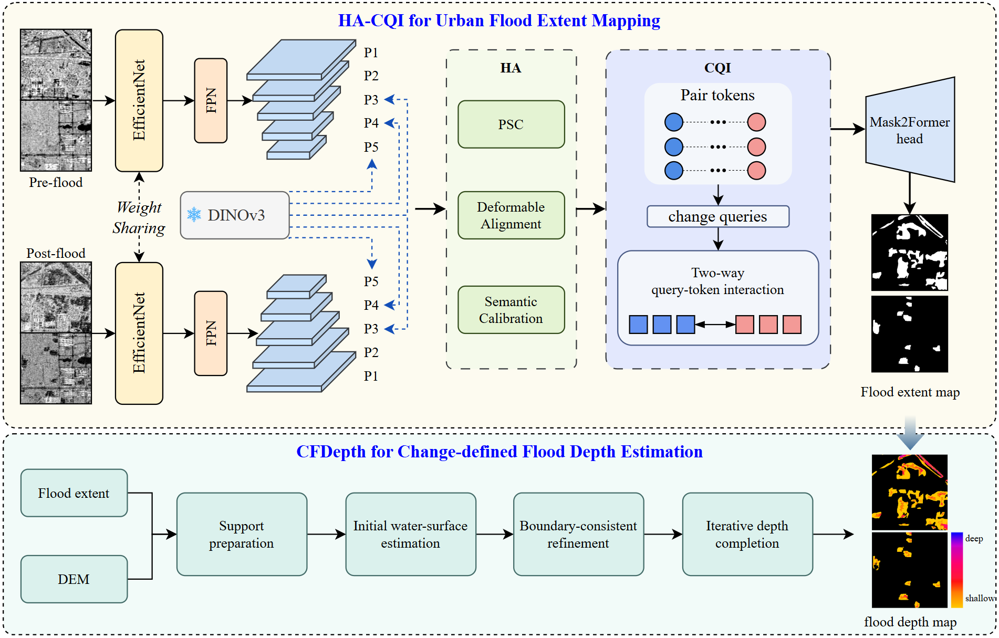

# HA-CQI and CFDepth for Urban Flood Extent Mapping and Change-Defined Depth Estimation from Bi-Temporal SAR Imagery

This repository provides a implementation for "HA-CQI and CFDepth, a bi-temporal SAR framework for urban flood extent mapping and change-defined depth estimation". 

Arch.
<center></center>

# Quick Guide

## Setup
Recommended: Python 3.10/3.11 with a CUDA-enabled PyTorch environment.

```bash
cd HA-CQI-CFDepth
conda create -n hacqi python=3.11
conda activate hacqi

# Install PyTorch for your CUDA version first.
pip install torch torchvision torchaudio --index-url https://download.pytorch.org/whl/cu118

# mmcv must match your PyTorch and CUDA versions.
# Example only; adjust the URL for your environment if needed.
pip install mmcv==2.2.0 -f https://download.openmmlab.com/mmcv/dist/cu118/torch2.4/index.html

pip install -r requirements.txt
```

## Dataset
Place all data under `datasets/`. The default training dataset is `datasets/train_set`.

Expected training structure:

```text
datasets/
└── train_set/
    ├── train/
    │   ├── A/                   # T1 SAR tiles
    │   ├── B/                   # T2 SAR tiles
    │   └── label/               # binary flood-change masks
    ├── val/
    │   ├── A/
    │   ├── B/
    │   └── label/
    └── channel_stats_s1gfloods_train.json
```

The default inference datasets are:

```text
datasets/
├── test_set_Zhengzhou/
└── test_set_Zhuozhou/
```

Each inference set should be a tiled SAR scene directory with `tile_manifest.csv`, A/B tile images, and valid-mask files generated by the scene preprocessing pipeline. `predict.py` uses the manifest to run tile-level prediction and reconstruct scene-level outputs.

## Pretrained Weights
Place all local pretrained weights under `pretrained/`.

Default files:

```text
pretrained/
├── dinov3_vits16_pretrain_lvd1689m-08c60483.pth
└── efficientnet_b0_ra-3dd342df.pth
```

## Train
Use `train.sh` for the default SAR flood-change training configuration:

```bash
bash train.sh
```

By default, the script uses:

- dataset: `datasets/train_set`
- DINO backbone: `dinov3_vits16`
- CNN backbone: `efficientnet_b0`
- stats file: `datasets/train_set/channel_stats_s1gfloods_train.json`
- output directory: `checkpoints/<run_name>/`

You can override common settings with environment variables:

```bash
GPU_IDS=0 BATCH_SIZE=4 RUN_NAME=HA-CQI-vits16 bash train.sh
```

For direct Python usage:

```bash
python train.py \
  --dataset train_set \
  --dataroot datasets \
  --dataset_mode sar \
  --stats_file datasets/train_set/channel_stats_s1gfloods_train.json \
  --dino_arch dinov3_vits16 \
  --dino_weight pretrained/dinov3_vits16_pretrain_lvd1689m-08c60483.pth \
  --backbone efficientnet_b0 \
  --backbone_weight pretrained/efficientnet_b0_ra-3dd342df.pth \
  --gpu_ids 0 \
  --batch_size 12 \
  --num_epochs 80 \
  --lr 1e-4 \
  --amp
```

## Predict
Use `predict.sh` to run the two default SAR scene inference sets sequentially:

```bash
bash predict.sh
```

The script runs:

- `datasets/test_set_Zhengzhou` -> `outputs/test_set_Zhengzhou`
- `datasets/test_set_Zhuozhou` -> `outputs/test_set_Zhuozhou`

Set `CHECKPOINT` to the trained HA-CQI checkpoint before running inference:

```bash
CHECKPOINT=checkpoints/HA-CQI-vits16/HA-CQI-vits16_efficientnet_b0_best.pth \
BATCH_SIZE=8 \
THRESHOLD=0.40 \
bash predict.sh
```

For direct Python usage on one tiled scene:

```bash
python predict.py \
  --tiles-root datasets/test_set_Zhengzhou \
  --checkpoint checkpoints/HA-CQI-vits16/HA-CQI-vits16_efficientnet_b0_best.pth \
  --stats_file datasets/train_set/channel_stats_s1gfloods_train.json \
  --gpu_ids 0 \
  --batch_size 8 \
  --threshold 0.40 \
  --output-dir outputs/test_set_Zhengzhou
```

The prediction pipeline saves tile-level masks, scene-level mosaics, and an `infer_report.json` file under the selected output directory.

## CFDepth for Google Earth Engine
`scripts/CFDepth_GEE.txt` provides the Google Earth Engine implementation of the CFDepth flood-depth estimation workflow. It is designed to run in the GEE Code Editor after importing a 0/1 flood GeoTIFF, where `1` denotes flood and `0` denotes background.

The script uses `FABDEM` by default and includes compact AOI extraction, lowest-feasible-boundary rescue, and water-surface propagation to estimate flood depth from an HA-CQI flood extent map or another binary flood mask. The GEE workflow displays the final depth layer and a sampled depth histogram, and can be used to export the flood-depth result.
